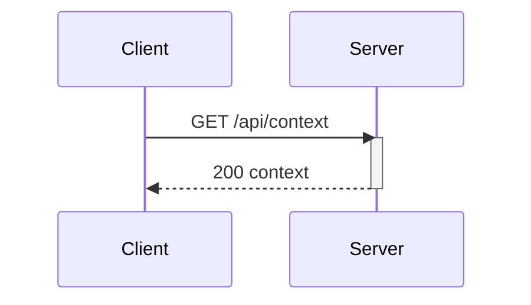

# Diagram Tool agent guide

## Concepts
- One context file (default `diagram-tool.context.json`) is the source of truth: `{rev, prompt, mermaidSource, scene}`.
- Every render bumps `rev`, rewrites sidecars (`.excalidraw.json` for excalidraw.com import, `.mmd` source), and the localhost UI (SSE `GET /api/live` push, refetches on rev change) applies the new rev without reload.
- UI canvas edits autosave back (`POST /api/scene`, stale rev -> 409). Prefer mermaid edits for structure; canvas for nudges.

## Recipes
- Create: author full mermaid -> `render_diagram` -> share `url`.
- Edit: `get_diagram` -> modify source preserving node IDs -> `render_diagram`.
- Restyle: same as edit (change classDefs/labels only).
- Import: paste an existing `.mmd` as `mermaidSource` and render.

## Few-shot: flowchart LR

```mermaid
%%{init: {"flowchart": {"nodeSpacing": 60, "rankSpacing": 90, "curve": "linear"}}}%%
flowchart LR
    USER["User"]
    CLI["diagram-tool CLI"]
    CTXFILE["diagram-tool.context.json"]
    WEBUI["React Excalidraw UI"]
    USER-->|invokes|CLI
    CLI-->|writes rev|CTXFILE
    CTXFILE-->|polls|WEBUI
    classDef actor fill:#e3f2fd,stroke:#1e88e5,stroke-width:2px
    classDef store fill:#fff3e0,stroke:#fb8c00,stroke-width:2px
    classDef flow fill:#e8f5e9,stroke:#43a047,stroke-width:2px
    classDef ext fill:#f3e5f5,stroke:#8e24aa,stroke-width:2px
    class USER actor
    class CLI,WEBUI flow
    class CTXFILE store
```

## Few-shot: sequenceDiagram

## Libraries: mandatory trigger, then choose
- TRIGGER (must use icons): request mentions AWS, GCP, Azure, Kubernetes, Docker, cloud, network, infrastructure, or icons/logos — or names services like Lambda, S3, EC2. Then: `list_libraries` -> `list_library_items` -> pass picks as `decorations` (max ~6). Skipping icons on these diagrams is wrong.
- Cloud/architecture/system-design -> vendor libs (aws/gcp/azure/kubernetes); network topologies -> `network-topology-icons`.
- Icons decorate labeled boxes; never drop labels.
- NO libraries for: logic flowcharts, sequence/ER/class/state diagrams (pure mermaid reads better).
- Node icon classes (`class USER actor,icon_user`) also work with the 10 bundled slugs: icon_user, icon_users, icon_home, icon_lock, icon_search, icon_chart, icon_email, icon_calendar, icon_location, icon_payment.

## Troubleshooting
| Symptom | Fix |
|---|---|
| Mermaid parse error (returned verbatim) | Fix syntax only, resend full source |
| Converter: no drawable elements / subgraph | Flatten subgraphs into plain nodes + edges |
| 409 rev conflict (UI edited meanwhile) | `get_diagram`, rebase, render again |
| Port 3000 taken | Server falls back to a free port; use returned `url` |
| Viewer bundle missing | Run the package build once (`node src/viewer/build.mjs`) |
| Library item index out of range | Error lists valid range; `list_library_items` to repick |
| Offline + uncached library | Connect once (fetch+cache) or stick to the 6 bundled libs |
