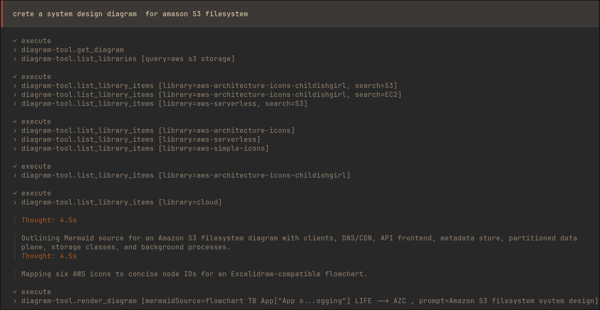
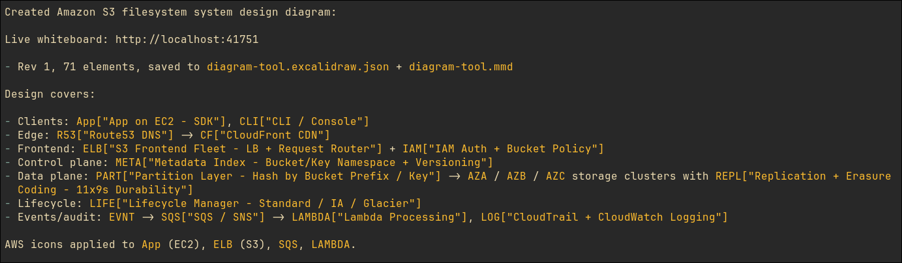
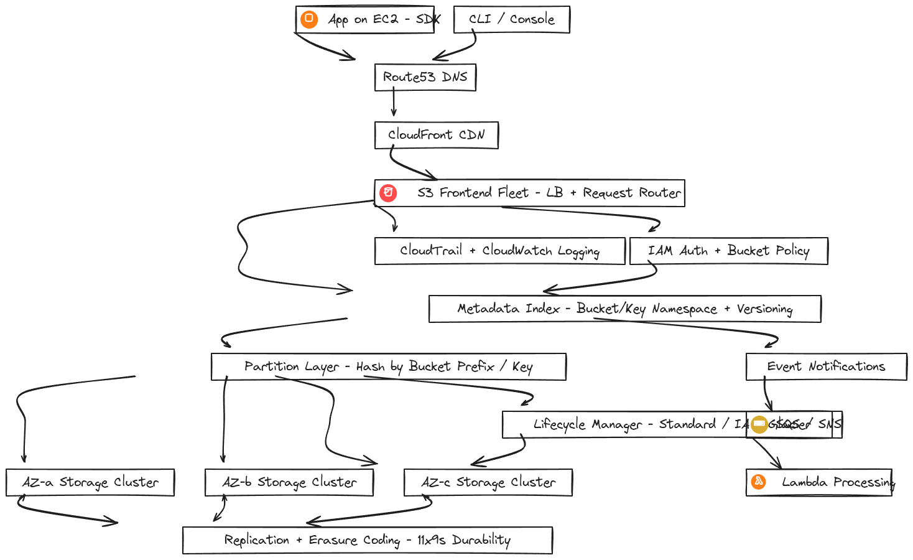

# Diagram Tool — agent-drawn Excalidraw on localhost, synced via a context file

No API key needed. Your coding agent is the LLM — `diagram-tool` only validates Mermaid, renders the scene, and serves the live UI.

## Recommended: MCP server (any coding agent)

**OpenCode** (`opencode.json`) — note the format differs from other agents:

```json
{ "mcp": { "diagram-tool": {
  "type": "local",
  "command": ["npx", "-y", "diagram-tool", "mcp"],
  "enabled": true
} } }
```

**Claude Code / Cursor / Windsurf / VSCode** (generic shape):

```json
{ "mcpServers": { "diagram-tool": { "command": "npx", "args": ["-y", "diagram-tool", "mcp"] } } }
```

Or auto-write it:

```bash
npm i -g diagram-tool        # or npx -y diagram-tool mcp (no install)
diagram-tool mcp-install --agent auto   # auto|opencode|claude|cursor|vscode
```

Then ask your agent to draw something, open the returned `url` once — it live-updates on every render.

Tools: `render_diagram(mermaidSource, prompt?, decorations?)` · `get_diagram()` · `list_libraries(query?)` · `list_library_items(library)` · resource `diagram-tool://guide`. Full authoring doc: [GUIDE.md](GUIDE.md) (also served to agents via the guide resource, so no LLM setup is needed).

## Example: agent-drawn S3 system design

Prompt: `crete a system design diagram for amason S3 filesystem` (typos and all — the agent copes).

The agent discovers icons first, then renders — MCP calls, verbatim:



Result summary with the live link (rev 1, 71 elements, sidecars written):



And the whiteboard itself — icons merged into their nodes, arrows on dagre's own routing:



## The context file (source of truth)

Everything revolves around `diagram-tool.context.json`:

```json
{ "version": 1, "rev": 3, "prompt": "...", "mermaidSource": "...",
  "scene": { "type": "excalidraw", "version": 2, "elements": [...] } }
```

- MCP/CLI writes it on every render (bumps `rev`, writes `.excalidraw.json` + `.mmd` sidecars).
- UI autosaves canvas edits back to it (`POST /api/scene`, debounced; on a rev conflict your edits are merged onto the fresh rev and retried, not discarded).
- UI subscribes to SSE `GET /api/live` (Hono server watches the file) and refetches on rev bumps, so agent edits appear in the open canvas without reload.

## Shell fallback (no MCP)

```bash
diagram-tool render --no-serve   # re-derive scene from the context file's mermaidSource
diagram-tool serve               # just the UI (default http://localhost:3000)
```

Agent loop without MCP: edit `mermaidSource` in the context file, run `diagram-tool render --no-serve`. Structural changes belong in `mermaidSource` + render; small canvas nudges can go straight into `scene.elements`.

## Libraries (excalidraw-libs)

`libraries/*.excalidrawlib` (v1 + v2) are served at `GET /api/libraries` for hand drag-drop, and composited server-side via `decorations` for agent renders. 6 payloads ship offline (network-topology, dev-ops, systemdesignicons, UML-ER, awesome-icons, system-icons); the full 232-library catalog is searchable via `list_libraries` (generated metadata with real item counts, refreshable via `node scripts/build-catalog.mjs`) and fetched on demand into `~/.cache/diagram-tool/libraries/`.

- `diagram-tool library list` — downloaded files + item count
- `diagram-tool library add <name>` — download from libraries.excalidraw.com (e.g. `diagram-tool library add aws`)
- Node icon classes also work: `class USER actor,icon_user` (slugs: `icon_user`, `icon_users`, `icon_home`, `icon_lock`, `icon_search`, `icon_chart`, `icon_email`, `icon_calendar`, `icon_location`, `icon_payment`)

Rule of thumb: cloud/architecture/network diagrams get ≤6 icons; logic flowcharts and sequence/ER/class diagrams stay pure mermaid. Agents follow this automatically — a mandatory library rule in the MCP instructions forces icon lookup (e.g. the 24 named AWS Serverless v2 icons) whenever cloud services are mentioned.

The viewer ships Excalidraw's real canvas fonts (Virgil, Cascadia, …) with the bundle, so labels render exactly as measured — no fallback-font overflow. (Only the 13MB CJK set is excluded; CJK falls back to system fonts.)

## BYOK fallback (optional, needs a key)

```bash
cp .env.example .env   # OPENROUTER_API_KEY=sk-or-...
diagram-tool "draw the request lifecycle of a REST API" --provider openrouter
diagram-tool edit "add a retry step" --provider openrouter
```

Flags: `--provider openai|anthropic|google|ollama|openrouter`, `--model`, `--api-key`, `--base-url`, `--port`, `--no-serve`, `--context`.

Pipeline: strict Mermaid parse → `mermaid-to-excalidraw` (dagre layout ships as-is — no post-passes) → flowchart-only arrow dedupe → icon replacement (scale-to-fit in the SDK box, opt-in `allowGrow` on proven slack) → arrow-label detach. The viewer ships Excalidraw's real canvas fonts, so what the agent lays out is what you see.
